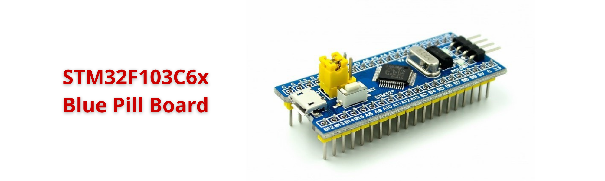

# STM32F103C6x Blue Pill Board

🚀 The STM32F103C6x Blue Pill Board is a popular, affordable development board based on the ARM Cortex-M3 microcontroller from STMicroelectronics. Known for its compact size and versatility, the Blue Pill is widely used by hobbyists, students, and professionals for prototyping embedded systems and learning ARM-based microcontroller programming.

## Buy It Now

You can purchase the STM32F103C6x Blue Pill Board from popular online retailers:

- 👉 [STM32F103C6x Blue Pill Board](https://s.shopee.vn/2g1CphtYMG)

<!-- Images Placeholder -->

<!-- Add more images as needed -->

🔑 Featuring a 32-bit processor, multiple GPIO pins, built-in peripherals (such as UART, SPI, I2C, ADC, and timers), and support for various development environments (including Arduino IDE, PlatformIO, and STM32Cube), the Blue Pill offers a flexible platform for a wide range of applications — from simple sensor interfacing to complex control systems.

📚 Its open hardware design, active community, and extensive documentation make the STM32F103C6x Blue Pill Board an excellent choice for anyone looking to explore embedded development with ARM microcontrollers.

# Embedded Launchpad
🚀 [Embedded Launchpad](/)

👇 Browse the following links for more details on each topic.
- 🔨 [ Development Boards](/development-boards/)
- 🎓 [Training Courses](/training-courses/)
- 📚 [Suggested Books](/suggested-books/)
- 🔍 [Reference Materials](/referrence-materials/)

# Embedded Insights
🔑 [Embedded Insights](https://github.com/ai-ho/embedded-insights/tree/main)

# Repositories
🏠 [My Repositories](https://github.com/ai-ho)

# Contact & Discussion
If you have any thing would like to discuss or cooperate with me, please don't hesitate to contact me via:
- 📧 Email [Ho Thien Ai](mailto:thienaiho95@gmail.com)
- 💼 LinkedIn [Thien Ai Ho](https://www.linkedin.com/in/thien-ai-ho/)
